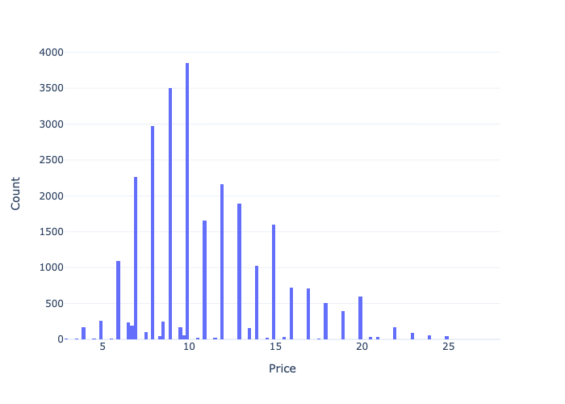
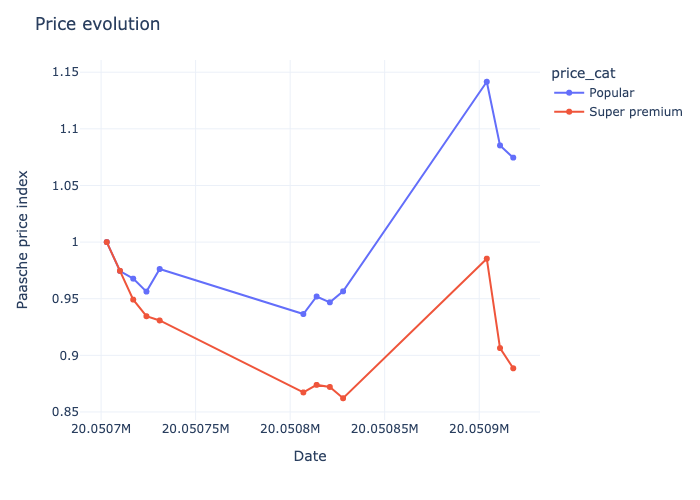
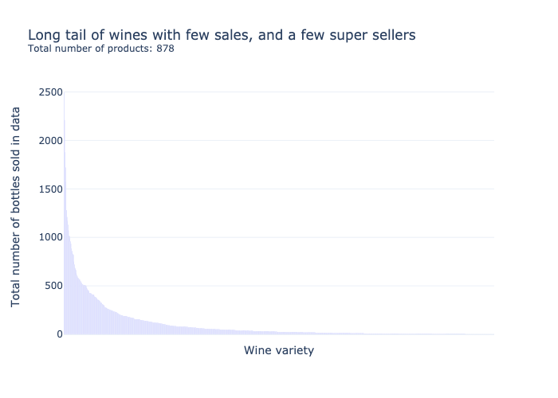
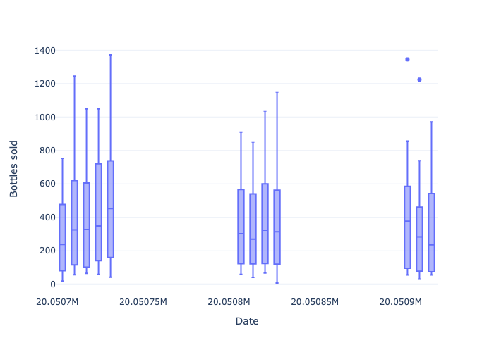
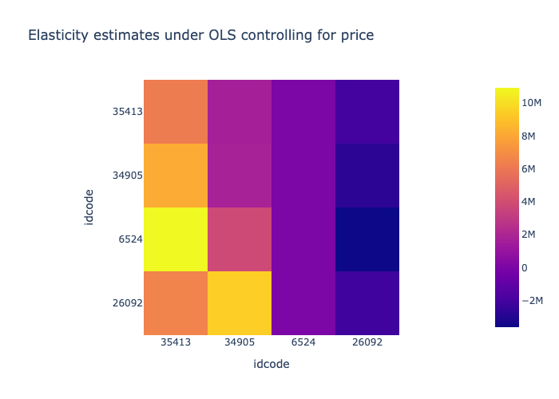

# Demand for Wine: Solutions to the Empirical Problem Set for Industrial Organization 2022
*Solutions by Filip Mellgren*, `filip.mellgren@su.se`

The problem set was solved using `python` and relies on the package `pyblp` by Christopher Conlon and Jeff Gortmaker.

## Descriptive Statistics

 Since we want to estimate demand for wine, important variables in the dataset `wine_ps2.dta` include the price variabel `p`, which denotes the nominal price, and the quantity variable `numbot`. The unit of observation are `idcode`, which identifies a wine, `date`, which denotes a unit of time (presumably week), and `storenum`, which is a code identifying an individual store. `numbot` is consequenlty the number of bottles sold of a particular wine in a given store in a given point in time. We can think of store and time as jointly defining a "market", which will be a useful concept when estimating the demand system. In total, there are 31798 wine-market observations, although I drop observations with NAs leaving me with 27189 observations. 

We begin by plotting the distribution of this price variable: 

Since we have data over time, we continue by looking at time trends for four, broad, price categories. Here, I define the categories by creating equally ranged bins. A wine connoisseur might disagree with the bins, but they work for our purpose nontheless:

We note that the price tends to be rather stable over the time horizon. However, it is interesting to note how *Value* wines increase in price while *Popular* drops towards the end of the sample frame. 

We proceed to look at the other key variable, `numbot`.

This diagram shows us that wine sales follow something resembling a geometric distribution. That is, a few wines make up the bulk of sales and and most wines do not matter greatly for sales.

We also look at the distribution of sales over time. Here, we consider the distribution of total sales over `storenum`.

### Data filtration
Based on the above, we do a selection of the data. TODO

## Demand estimation using naive regression

To understand how price and quantity are interlinked, we begin by simple Hedonic regressions between quantity and price. Clearly, prices are endogenous since higher quality increases both quantity and price, so we should not trust the following estimates to give us the actual price elasticities. The following regression is run:

$$\ln{Q_{i,s,t}} = \beta_{0, i} +  \ln P \beta_{1, i} + \varepsilon_{i,s,t}$$

With $P$ being a price matrix for all wines in the subselection, over all store, date indices. $\beta_{1, i}$ is therefore a vector of the same length as the number of wines we consider and specific to wine $i$. Notice how increasing the number of wines considered scales the number of parameters needed to be estimated quadratically, which is why we decided to restrict the sample to the most popular wines. 
We can combine all estimates into a cross price elasticity matrix, with own-price elasticities along the diagonal:

However, this is unlikely to show accurate estimates of anything due to price being endogenous. 

## Demand estimation using discrete choice 

Under the discrete choice approach to demand estimation, consumers face a set or products in the market indexed by $j = 1,..,J$, and at each occasion, consumers purchase at most one of the goods or an outside option indexed by $j = 0$. Utility for the consumer $i$ is given by: 

$$u_{ij}^* = \mathbf{x}_t \beta - \alpha p_j + \xi_j + \epsilon_{j} + \epsilon_{ij}= \delta_j + \xi_j + \epsilon_{ij}$$

where we assume $\epsilon_{ij}$ is iid across products and follows an extreme value distribution of type II. TODO is it not 1? and $\delta_j$ is a deterministic part of the utility of product $j$.

For this specification, we can write market share as follows:

$$s_j(\delta) = \frac{\exp^{\delta_j}}{\left(\sum_{r = 0}^{N}\exp{\delta_r} \right)}$$.

More elaborate: 

$$\frac{\exp{\alpha p_{j,t} + x_{j,t} \beta^{ex} + \xi_{jt}}}{1 + \sum_{k} \exp{\left(\alpha p_{k,t} + x_{k,t} \beta^{ex}+ \xi_{kt}\right)}}$$

Where the "1"-term comes form the outside good which is normalized to give utility zero. The outside good allows for many consumers not buying in case there is a market wide increase in price. Note

Take logs and subtract log of outside good market share to obtain:

$$\ln{s_j} - \ln{s_0} = x_j \beta - \alpha p_j + \xi_j$$

Where we observe the left hand side in the data and so can estimate the relationship using regression.

Having estimates of $\alpha$, we can then back out own and crossprice elasticities:

* If $j = k$, then: $\varepsilon_{jk}^d = \frac{\partial s_j}{\partial p_k}\frac{p_k}{s_j} = -\alpha p_j(1-s_j)$
* If $j \neq k$, then: $\varepsilon_{jk}^d = \alpha p_k s_k$

There are several specifications for which we will repeat the exercise and we begin with the most simple.

For all specifications I will define the total market size as a constant multiplied by the store maximum number of bottles sold at any point in time. Using the maximal sales in a given store provides a lower bound for the total market size of a store-time combination assuming that there is no large change in population. I let the multiplying constant be 2, meaning that people can drink at most twice as much as the record observed in the data.

### Estimation using product characteristics

### Estimation using the fixed-effects estimator
Under the fixed effects estimator, the parameters $(\alpha, \beta)$ can be identified by assuming $E[\eta_{jm} \vert \mathbf{x}_{jm}'] = 0$ and $E[\eta_{jm} \vert p_{jm}]=0$, i.e. prices are exogenous. If we find that $\alpha < 0$, we might have endogeneity problems since rthis would mean that consumers' utility increase with prices. 

### Estimation using BLP-style instruments

Instruments:
* Cost shifters
* Characteristcs of competing products. So called BLP instruments. Price of the same product in other markets. Hausman 1997, Neco 2001. 

### Estimation using nested logit
Notice how the elasticities so far are constrained to, in the case of own-price elasticities, be propiortional to own price, or in the case of crossprice elasticities, proprotional to market shares. A remedy to this is to introduce a so-called Nested Logit.

TODO: how to define outside good? I think we can just calculate the shares under an assumption of market size and have them not sum to one.
TODO: nest based on red/white?
Leave out agent specific portion to obtain Berry 1994. Yes, Berry is just a simpler case without agent specific data (alternativley it does include that, and leaves out rabndom coefficents)

<\font>

