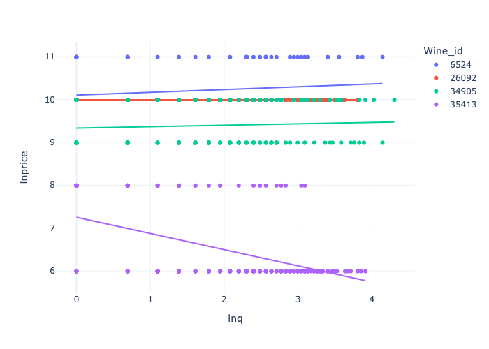
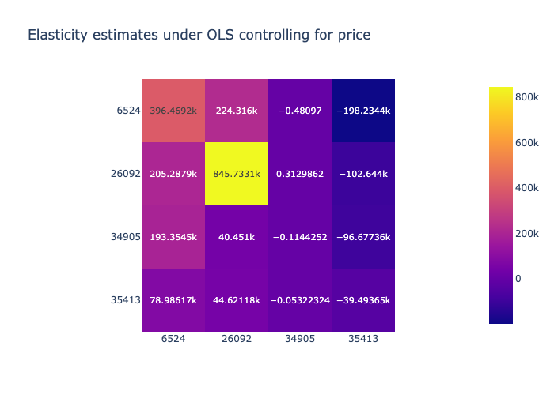
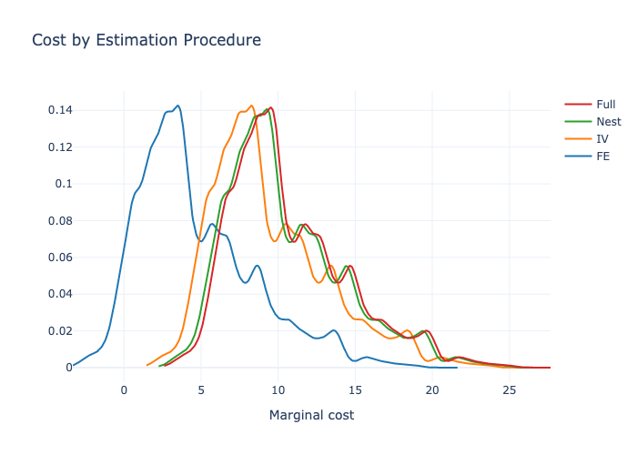

---
output:
  pdf_document:
    fig_width: 2
    fig_height: 2
  html_document: default
---

  
# Demand for Wine: Solutions to the Empirical Problem Set for Industrial Organization 2022
*Solutions by Filip Mellgren*, `filip.mellgren@su.se`

The problem set was solved using `python` and relies on the package `pyblp` by Christopher Conlon and Jeff Gortmaker.

## Descriptive Statistics

 Since we want to estimate demand for wine, important variables in the dataset `wine_ps2.dta` include the price variabel `p`, which denotes the nominal price, and the quantity variable `numbot`. The unit of observation is a combination of `idcode`, which identifies a wine, `date`, which denotes a unit of time (presumably week), and `storenum`, which is a code identifying an individual store. `numbot` is consequenlty the number of bottles sold of a particular wine in a given store in a given time interval. We can think of store and time as jointly defining a "market", which will be a useful concept when estimating the demand system. In total, there are 31798 wine-market observations, although I drop observations with NAs leaving me with 27189 observations. 

We begin by plotting the distribution of this price variable: 

{width="70%"}

We see that prices follow a fairly typical distribution, skewed towards the right. Most wines tend to be sold at less than $10, and some wines are sold at $25.

Since we have data over time, we continue by looking at time trends for four, broad, price categories. Here, I define the categories by creating equally ranged bins. A wine connoisseur might disagree with the bins, but they work for our purpose nontheless:

{width="70%"}

We note that the price tends to be rather stable over the time horizonm which is rather short. However, it is interesting to note how *Value* wines increase in price while *Popular* drops towards the end of the sample frame. 

We proceed to look at the other key variable, `numbot`.

{width="70%"}

This diagram shows us that wine sales follow something resembling a geometric distribution. That is, a few wines make up the bulk of sales and and most wines do not matter greatly for sales.

We also look at the distribution of sales over time. Here, we consider the distribution of total sales over `storenum`.

{width="70%"}

This figure tells us that stores vary greatly in size. Some stores sell less than 50 bottles, and others sell more than a thousand. There does not seem to be any clear time trend over the horizon covered by our data.

For a selection of the best selling wines, I also look at the relationship between price and quantities:

{width="70%"}

This image shows that prices mostly stay constant but occassionally differs substantially between markets. Demand varies substantially due to the differences in store size but the relationship between price and number of bottles sold is weak in the raw data, telling us that we need to substantially work with the data to understand what the true price elasticities of demand are. 

## Demand estimation using naive regression

To understand how price and quantity are interlinked, we proceed with a simple Hedonic regression between quantity and price, controlling for prices of other wines in the market and other controls. The following regression is run:

$$\ln{Q_{i,t}} = \beta_{0, i} +  \ln P \beta_{1, i} + X_{i}\beta_{2, i} + \varepsilon_{i,t}$$

Where $i$ denotes the wine index, and $t$ is the market index. $P$ is a price matrix for all wines in the subselection, over all store, date indices. $\beta_{1, i}$ is therefore a vector of the same length as the number of wines we consider and specific to wine $i$. Notice how increasing the number of wines considered scales the number of parameters needed to be estimated quadratically, which is why we need to to restrict the sample to the 4 most popular wines, this gives me 16 parameters to estimate. Including more wines in this regression would quickly give rise to more parameters than we have observations.

I also control for total number of bottles sold in the store,`num_bot_market`, as well as `doc` indicating whether the wine was made according to European region of origin rules, and `proof`, which is the alcoholic content of the wine.

If we could estimate the relationship without bias, we can interpret $\beta_{1,j}$ as an elasticity vector and we can combine all estimates into a cross price elasticity matrix, with own-price elasticities along the diagonal:

{width="70%"}

However, this is unlikely to show accurate estimates of anything due to price being endogenous, despite our control variables. Indeed, we note how the resulting heat map of estimated elasticities gives unrealistic estimates. We would expect diagonal values to be negative, and off-diagonal values to be positive and smaller in magnitude than diagonal values. The bias occurs because despite our controls, we still have omitted variable bias. Notably, we fail to perfectly control for perceived quality which will affect both quantity and prices in the same direction, so our estimates will have an upward bias and we conclude that estimated coefficients can not be interpreted as price elasticities.

## Demand estimation using discrete choice

Under the discrete choice approach to demand estimation, consumers face a set of products  indexed by $j = 1,..,J$ in market $t$, and at each occasion, consumers purchase at most one of the goods or an outside option indexed by $j = 0$. In a simplified version of the problem where we don't model or try to capture agent heterogeneity, utility for consumer $i$ can be written as:

$$u_{ijt}^* = \mathbf{x}_{jt} \beta - \alpha p_{jt} + \xi_{jt} + \epsilon_{jt} + \nu_{ijt}= \delta_{jt} + \xi_{jt} + \nu_{ijt}$$

where we assume $\nu_{ijt}$ is iid across products and follows an extreme value distribution of type II and $\delta_{jt}$ is a deterministic part of the utility of product $j$ in market $t$.

Under this specification, the probability that a consumer choose product $j$ in market $t$ is: 

$$s_{jt} = \frac{\exp{\left(\alpha p_{j,t} + \mathbf{x}_{jt} \beta + \xi_{jt}\right)}}{1 + \sum_{k} \exp{\left(\alpha p_{k,t} + \mathbf{x}_{kt} \beta+ \xi_{kt}\right)}}$$

Which in expectation thus becomes the market share of product $j$ in market $t$.

The "1"-term comes form the outside good which is normalized to give utility zero. The outside good allows for many consumers not buying in case there is a market wide increase in price. 

In this special case, where we do not model correlated preferences of individuals by allowing for random coefficients, we can find a linear relationship analytically by taking logs and differencing with the log of outside good market share to obtain:

$$\ln{s_{jt}} - \ln{s_{0,t}} = x_{j,t} \beta - \alpha p_{jt} + \xi_{jt}$$

Where we observe the left hand side in the data and so can estimate $\alpha, \beta$ using common estimators such as OLS, fixed effects, IV, and 2SLS. 

Having estimates of $\alpha$, we can then back out own and crossprice elasticities in each market $t$:

* If $j = k$, then: $\varepsilon_{jk}^d = \frac{\partial s_j}{\partial p_k}\frac{p_k}{s_j} = -\alpha p_j(1-s_j)$
* If $j \neq k$, then: $\varepsilon_{jk}^d = \alpha p_k s_k$

From the demand elasticity we can continue to find markups $\mu_j = -\frac{s_j}{\partial s_j / \partial p_j} = -\frac{1}{\alpha p_j (1-s_j)}$, and from there marginal costs assuming they are constant: $c_j = p_j(1-\mu_j)$.

With the theory in place, we now turn to practice. There are several specifications for which we will repeat the exercise and we begin with the most simple version which uses the OLS-estimator, controlling for product characteristics. 

To estimate the relationship, we are also going to determine market shares for which we need to know the market size. For all specifications I will assume the total market size as a constant multiplied by the store maximum number of bottles sold at any point in time. Using the maximal sales in a given store provides a lower bound for the total market size of a store-time combination assuming that there is no large change in population. I let the multiplying constant be 2, meaning that people can drink at most twice as much as the record observed for a store in the data. 

### Estimation using product characteristics

For an initial estimation, we can estimate the linear relationship above using the OLS-estimator while controlling for product characteristics believed to introduce bias by being correlated with both price and quantity sold. Such variables, that we observe, include:

* `proof`, the alcoholic content of the wine.
* `doc`, which is an indicator of whether the wine is made according to European region of origin rules. I think receiving this certification signals higher quality (so conusmers gain more utility), and allows producers to charge a higher price and should therefore be controlled for.
* `variet` which is an indicator of whether the wine is made of a specific grape variety, think of Bordeaux, blends, vs Burgundy, pinot noir, which are both two excellent wine regions. 

Mere product chacteristics is likely to give biased estimates due to unobserved features of the wines. Wines are complex products with many different attributes and so it is clear that simply controlling for variables such as alcoholic content won't accurately describe the wines. One improvement is to control for any aspect of the wines that does not change over time, such as quality, using the fixed effects estimator, which we turn to next.

|    |          0 |           prices |           proof |         variet |          doc |                          
|---:|-----------:|------------:|------------:|----------:|-----------:|
|  Coef | -5.99378   | -0.0298285  | -0.0200331  | 0.0361685 | -0.0731505 |
|  SE |  0.0939892 |  0.00137211 |  0.00704209 | 0.0266632 |  0.0285129 |

We find that higher prices are associated with lower shares, which is in line with what we would expect. However, the estimate is rather low and likely has upward bias stemming from failing to control for wine quality. The implied markups tend to exceed 1. Remember how the markups are identified as: $$\mu_j = -\frac{1}{\alpha p_j(1-s_j)}$$, where $\alpha = -0.0298285$ in this case, so assuming $p_j = 10$, $s_j = 0.1$, the implied markup is 3.72... which implies marginal costs are negative which clearly is nonsense. I therefore do not report these estimates. 

### Estimation using the fixed-effects estimator

Under the fixed effects estimator, the parameters $(\alpha, \beta)$ can be identified by assuming that there is nothing that varies between markets that affect price, such as how much advertising is spent on the product in different markets.

|    |           prices |                                                                              
|---:|------------:|
|  $\alpha$ | -0.158698   |
|  SE |  0.00645487 |

Using this estimator, our estimate shrinks considerably. This estimate suggests that a price increase affects sales considerably more than the OLS estimates. We will still obtain some negative costs and markups greater than 1. However, results will be more plausible and I choose to report markups in the figure below. 

### Estimation using BLP-style instruments

If we have reasons to believe that fixed effects are not enough to control for plausible endogeneity, we can use the IV estimator. Potential excluded instrumental variables could be variables that affect prices through its effect on supply and not demand (which generates movement along the demand curve), or variables that affect demand only through prices, such as characteristics of competing goods in the different markets (so called BLP-instruments).

For the estimation I tested three instruments in different combinations and individually:

* `fx`, the foreign currency exchange rate which affects supply but not demand.
* Number of `doc` sold in the market other than the product itself. 
* Count of competing wines. Should shift demand but not supply.

The last two instruments are BLP-instruments, i.e. functions of characteristics of other wines. I find that the BLP-instruments lead to implausibel estimates, and report results from an IV estimation using just the foreign exchange rate instrument.

|    |         prices |
|---:|----------:|
|  $\alpha$ | -0.653045 |
|  SE |  0.202694 |

We now find even lower price elasticities of demand, suggesting that also the fixed effects estimator failed to account for all effects affecting quantities and prices. The foreign exchange instrument is lucrative as it surely affects costs of importing the wines, but should have little effect on US consumers demand for wine. Note, I build upon the previous estimate by still absorbing product fixed effects as results otherwise become implausible again. 

### Estimation using nested logit

Even if we now have well-identified demand parameters, we can still do better if our model is miss-specified. Notice how the elasticities shown above are constrained to, in the case of own-price elasticities, be proportional to own price, or in the case of crossprice elasticities, proprotional to market shares. A remedy to this is to introduce a so-called Nested Logit which allows for a richer structure. 

Note that when estimating using nests, we can define an instrument as the number of products per nest, which would be a BLP-styled instrument. I use this instrument as it seems to perform well.

|    |           prices |
|---:|------------:|
|  $\alpha$ | -0.582255   |
|  SE |  0.00634275 |

### Extra estimation for fun
I also report results where I absorb fixed effects, allow for nests, and use the foreign exchange rate instrument and find the following coefficient: 

|    |         prices |                                                              
|---:|----------:|
|  $\alpha$ | -1.12655  |
|  SE |  0.177135 |

I.e. much higher than any other estimate. Perhaps the most plausible coefficient. 

### Results from estimation
If we find that $\alpha < 0$, we might have endogeneity problems since this would mean that consumers' utility increase with prices. We should also be cautious whenever implied markups are larger than one, which means costs are estimated to be negative. 

|           Percentile             |     5 |   25 |   50 |   75 |   95 |           
|:-----------------------|-----------:|----------:|----------:|----------:|----------:|
| **Controls**, MC     | -27.5511   | -25.5509  | -23.5619  | -20.5522  |  -14.5829 |
| markup |   1.76793   |   2.58216   |   3.35855   |   4.19786   |   5.59952   |
| **FE**, MC           |  -0.314326 |   1.68571 |   3.68365 |   6.68547 |   12.6797 |
|  markup       |   0.332296  |   0.485337  |   0.631266  |   0.789022  |   1.05248   |
| **Full**, MC         |   5.72102  |   7.72253 |   9.72099 |  12.7224  |   18.7153 |
|  markup     |   0.0147266 |   0.0206415 |   0.0269982 |   0.0336975 |   0.051298  |
| **IV**, MC           |   4.45797  |   6.45798 |   8.45748 |  11.4579  |   17.4565 |
| markup       |   0.080752  |   0.117943  |   0.153405  |   0.191742  |   0.255764  |
| **NL**, MC           |   5.46697  |   7.4721  |   9.46948 |  12.4722  |   18.4579 |
| markup       |   0.0284933 |   0.0399375 |   0.0522365 |   0.0651982 |   0.0992519 |

{width="70%"}

{width="70%"}

Note how cost results are simply shifted versions of the same density.

## Further steps

So far, we've only considered a benchmark model. To further refine the analysis we can:

* Include agent heterogeneity, thereby allowing for random coefficients
* Take demographic data into account
* Bootstrap standard errors for markups and costs

