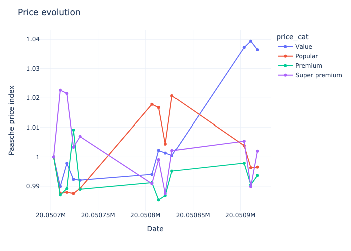

# Demand for Wine: Solutions to the Empirical Problem Set for Industrial Organization 2022
*Solutions by Filip Mellgren*, `filip.mellgren@su.se`

The problem set was solved using `python` and relies on the package `pyblp` by Christopher Conlon and Jeff Gortmaker.

## Descriptive Statistics

 Since we want to estimate demand for wine, important variables in the dataset `wine_ps2.dta` include the price variabel `p`, which denotes the nominal price, and the quantity variable `numbot`. The unit of observation are `idcode`, which identifies a wine, `date`, which denotes a unit of time (presumably week), and `storenum`, which is a code identifying an individual store. `numbot` is consequenlty the number of bottles sold of a particular wine in a given store in a given point in time. We can think of store and time as jointly defining a "market", which will be a useful concept when estimating the demand system. In total, there are 31798 wine-market observations, although I drop observations with NAs leaving me with 27189 observations. 

We begin by plotting the distribution of this price variable: 

Since we have data over time, we continue by looking at time trends for four, broad, price categories. Here, I define the categories by creating equally ranged bins. A wine connoisseur might disagree with the bins, but they work for our purpose nontheless:

We note that the price tends to be rather stable over the time horizon. However, it is interesting to note how *Value* wines increase in price while *Popular* drops towards the end of the sample frame. 

We proceed to look at the other key variable, `numbot`.

This diagram shows us that wine sales follow something resembling a geometric distribution. That is, a few wines make up the bulk of sales and and most wines do not matter greatly for sales.

We also look at the distribution of sales over time. Here, we consider the distribution of total sales over `storenum`.

For a selection of the bes tselling wines, I also look at the relationship between price and quantities:

This image shows that prices rarely vary across markets, but that demand does vary substantially. TODO: note that this is raw data and I haven't controlled for store size.

### Data filtration
Based on the above, we do a selection of the data. TODO

## Demand estimation using naive regression

To understand how price and quantity are interlinked, we begin by simple Hedonic regressions between quantity and price plus prices of other wines in the market. The price variable will be endogenous since higher quality increases both quantity and price, so we should not trust the following estimates to give us the actual price elasticities. The following regression is run:

$$\ln{Q_{i,t}} = \beta_{0, i} +  \ln P \beta_{1, i} + X_{i}\beta_{2, i} + \varepsilon_{i,t}$$

Where $i$ denotes the wine index, and $t$ is the market index.

With $P$ being a price matrix for all wines in the subselection, over all store, date indices. $\beta_{1, i}$ is therefore a vector of the same length as the number of wines we consider and specific to wine $i$. Notice how increasing the number of wines considered scales the number of parameters needed to be estimated quadratically, which is why we need to to restrict the sample to the most popular wines. I also control for total number of bottles sold in the store, `doc` indicating whether the wine was made according to European region of origin rules, and `proof`, which is the alcoholic content of the wine.

If we could estimate the relationship without bias, we can interpret $\beta_{1,j}$ as an elasticity vector and we can combine all estimates into a cross price elasticity matrix, with own-price elasticities along the diagonal:

However, this is unlikely to show accurate estimates of anything due to price being endogenous. Indeed, we note how the resulting heat map of estiomated elasticities gives unrealistic estimates.

## Demand estimation using discrete choice

Under the discrete choice approach to demand estimation, consumers face a set or products  indexed by $j = 1,..,J$ in market $t$, and at each occasion, consumers purchase at most one of the goods or an outside option indexed by $j = 0$. In a simplified version of the problem where we don't model or try to capture agent heterogeneity, utility for the consumer $i$ can be written as:

$$u_{ijt}^* = \mathbf{x}_{jt} \beta - \alpha p_{jt} + \xi_{jt} + \epsilon_{jt} + \nu_{ijt}= \delta_{jt} + \xi_{jt} + \nu_{ijt}$$

where we assume $\nu_{ijt}$ is iid across products and follows an extreme value distribution of type II and $\delta_{jt}$ is a deterministic part of the utility of product $j$ in market $t$.

Under this specification, the probability that a consumer choose $j$ in market $t$ is: 

$$s_{jt} = \frac{\exp{\left(\alpha p_{j,t} + \mathbf{x}_{jt} \beta + \xi_{jt}\right)}}{1 + \sum_{k} \exp{\left(\alpha p_{k,t} + \mathbf{x}_{kt} \beta+ \xi_{kt}\right)}}$$

Which in expectation is also the market share of product $j$ in market $t$. 

The "1"-term comes form the outside good which is normalized to give utility zero. The outside good allows for many consumers not buying in case there is a market wide increase in price. 

In this special case, where we do not model correlated preferences of individuals by allowing for random coefficients, we can find a linear relationship analytically by taking logs and differencing with the log of outside good market share to obtain:

$$\ln{s_j} - \ln{s_0} = x_j \beta - \alpha p_j + \xi_j$$

Where we observe the left hand side in the data and so can estimate $\alpha, \beta$ using regression analsysis and common estimators such as OLS, fixed effects, IV, and 2SLS. 

Having estimates of $\alpha$, we can then back out own and crossprice elasticities:

* If $j = k$, then: $\varepsilon_{jk}^d = \frac{\partial s_j}{\partial p_k}\frac{p_k}{s_j} = -\alpha p_j(1-s_j)$
* If $j \neq k$, then: $\varepsilon_{jk}^d = \alpha p_k s_k$

From demand elasticity we can continue and find marginal costs, and markups. TODO: how.

With the theory in place, we now turn to practice. There are several specifications for which we will repeat the exercise and we begin with the most simple version which uses the OLS-estimator, controlling for product characteristics. 

To estimate the relationship, we are also going to determine market shares for which we need to know the market size. For all specifications I will assume the total market size as a constant multiplied by the store maximum number of bottles sold at any point in time. Using the maximal sales in a given store provides a lower bound for the total market size of a store-time combination assuming that there is no large change in population. I let the multiplying constant be 2, meaning that people can drink at most twice as much as the record observed in the data. 

### Estimation using product characteristics

For an initial estimation, we can estimate the linear relationship above using the OLS-estimator while controlling for product characteristics believed to introduce bias by being correlated with both price and quantity sold. Such variables, that we observe, include:

* `proof`, the alcoholic content of the wine.
* `doc`, which is an indicator of whether the wine is made according to European region of origin rules. I think receiving this certification signals higher quality (so conusmers gain more utility), and allows producers to charge a higher price and should therefore be controlled for.
* `variet` which is an indicator of whether the wine is made of a specific grape variety, think of Bordeaux, blends, vs Burgundy, pinot noir, which are both two excellent wine regions. 

Mere product chacteristics is likely to give biased estimates due to unobserved features of the wines. Wines are complex products with many different attributes and so it is clear that simply controlling for variables such as alcoholic content won't accurately describe the wines. One improvement is to control for any aspect of the wines that does not change over time, such as quality, using the fixed effects estimator, which we turn to next.

### Estimation using the fixed-effects estimator

Under the fixed effects estimator, the parameters $(\alpha, \beta)$ can be identified by assuming that there is nothing that varies between markets that affect price, such as how much advertising is spent on the product in different markets.

### Estimation using BLP-style instruments

If we have reasons to believe that fixed effects are not enough to control for plausible endogeneity, we can use the IV estimator. Potential excluded instrumental variables could be variables that affect prices through its effect on supply and not demand (which generates movement along the demand curve), or variables that affect demand only through prices, such as characteristics of competing goods in the different markets (so called BLP-instruments).

For the estimation I make use of three instruments:
* `fx`, the foreign curtrency exchange rate which affects supply bot not demand
* Number of `doc` being osld in the market.
* Count of competing wines.

The last two instruments are BLP-instruments, i.e. functions of characteristics of other wines. 

### Estimation using nested logit
Even if we now have well-identified demand parameters, we can still do better if our model is miss-specified. Notice how the elasticities shown above are constrained to, in the case of own-price elasticities, be propiortional to own price, or in the case of crossprice elasticities, proprotional to market shares. A remedy to this is to introduce a so-called Nested Logit which allows for a richer structure. 

### Results from estimation
If we find that $\alpha < 0$, we might have endogeneity problems since rthis would mean that consumers' utility increase with prices. 

TODO: how to define outside good? I think we can just calculate the shares under an assumption of market size and have them not sum to one.
TODO: nest based on red/white?
Leave out agent specific portion to obtain Berry 1994. Yes, Berry is just a simpler case without agent specific data (alternativley it does include that, and leaves out rabndom coefficents)

TODO: figure with all markups and costs. 

<\font>

## Further steps

So far, we've only considered a becnhmark model. To further refine the analysis we can:
* Include agent heterogeneity, thereby allowing for random coefficients
* Take demographic data into account
* Bootstrap standard errors for markups and costs

In the special case where we (there is no unobserved agent characteristcs, Sigma is 0, Pi * d can still exist, where d is the observed agent characteristics) don't incorporate information on cosumer heterogeneity such as income distribution,

Instruments:
* Cost shifters
* Characteristcs of competing products. So called BLP instruments. Price of the same product in other markets. Hausman 1997, Neco 2001. 

